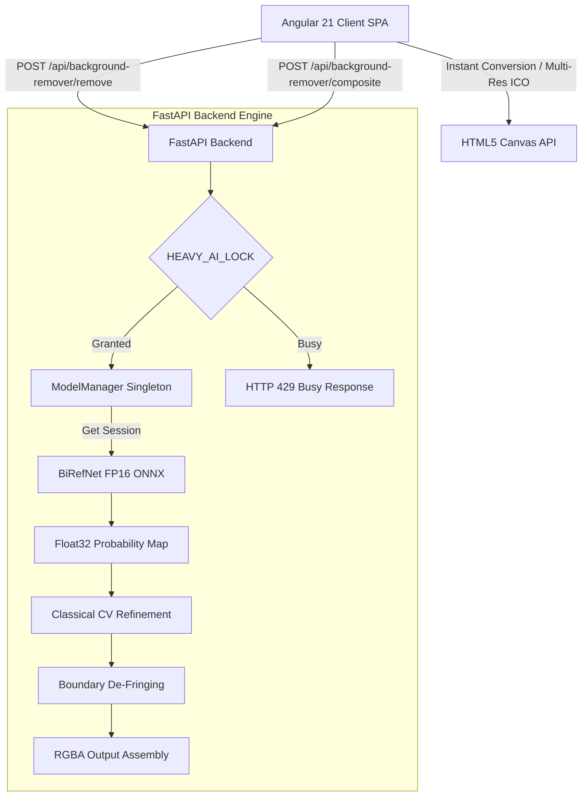
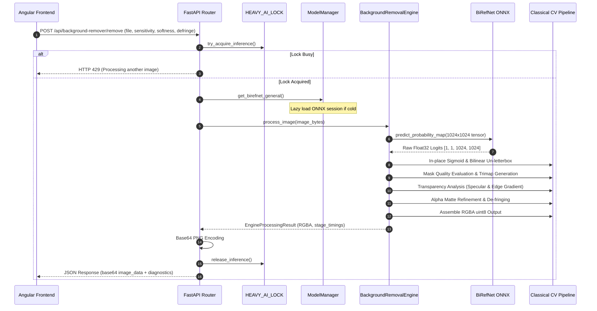
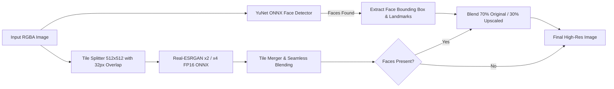

# Application Architecture

## 1. High-Level Architecture Overview

The system follows a modern decoupled architecture:
- **Frontend Layer**: Angular 21 Single Page Application (SPA) handling client-side image editing, workspace state, instant format conversions, multi-resolution ICO encoding, and UI rendering.
- **Backend API Layer**: FastAPI ASGI server executing asynchronously on Uvicorn, serving endpoints for heavy machine learning inference tasks.
- **AI Inference Layer**: ONNX Runtime execution engine (`CUDAExecutionProvider` or `CPUExecutionProvider`) managing BiRefNet FP16, Real-ESRGAN FP16, and YuNet FP32 models.



---

## 2. Frontend Architecture

- **UI Components**:
  - `WorkspaceComponent`: Primary workspace canvas, cropping controls, custom tuning sliders (Sensitivity, Edge Softness, De-Fringe).
  - `BgRemoverComponent`: AI Background removal modal, processing status, and background replacement preview.
  - `ResultScreenComponent`: Cutout display, HD export buttons (2x/4x), format selector, and download trigger.
- **State Management**:
  - `ConversionStateService`: Managed via Angular Signals (`signal`, `computed`) for active files, current options, conversion status, and result data.
- **Services**:
  - `BgRemoverService`: Handles HTTP POST communication with FastAPI backend endpoints (`/api/background-remover/remove`, `/api/background-remover/composite`, `/api/background-remover/export-hd`).
  - `ImageEncoderService` (`image-encoders.ts`): Client-side Canvas manipulation, image scaling, cropping, matrix color transformations, and multi-resolution ICO generation (16x16 to 512x512 PNG entries).

---

## 3. Backend Architecture

- **FastAPI Router**:
  - Routes configured in `backend/background_remover/api/routes.py` with prefix `/api/background-remover`.
- **Model Lifecycle & Management**:
  - `ModelManager` Singleton (`backend/segmentation/model_manager.py`):
    - Lazy loading on first request.
    - Session caching and warm reuse.
    - Thread-safe single-inference lock (`HEAVY_AI_LOCK`).
    - 90-second idle timeout auto-unload task.
- **Processing Pipelines**:
  - `BackgroundRemovalEngine` (`backend/background_removal_engine.py`): Orchestrates classical CV pipeline around BiRefNet ONNX inference.
  - `SuperResolutionManager` (`backend/processing/super_resolution.py`): Real-ESRGAN upscaling engine with overlap tiling and YuNet face preservation.

---

## 4. Background Removal Pipeline Flow



---

## 5. Super-Resolution & Face Preservation Pipeline



---

## 6. Client-Side Conversion Architecture

- **Canvas 2D API Execution**:
  - Image loaded into `HTMLImageElement` -> drawn to offscreen `HTMLCanvasElement`.
  - Format conversions executed via `canvas.toDataURL()` or `canvas.toBlob()`.
- **Multi-Resolution ICO Encoder**:
  - Encodes ICO container containing 8 PNG header entries:
    `16×16`, `24×24`, `32×32`, `48×48`, `64×64`, `128×128`, `256×256`, `512×512`.
  - Every resolution is generated independently from the original high-resolution canvas source to maintain sharp icon edges.

---

## 7. Model Lifecycle States

```
[ UNLOADED / IDLE ]
        │
        │ First API Request Arrives
        ▼
[ LOADING_MODEL ]  ◄── Lazy Single-Flight Load (_load_lock)
        │
        ▼
[ READY / WARM ]   ◄── Session Cached in RAM/VRAM
        │
        │ Request Starts (Acquires HEAVY_AI_LOCK)
        ▼
[ PROCESSING ]     ◄── Running ONNX Inference & Post-Processing
        │
        │ Request Completes (Releases HEAVY_AI_LOCK)
        ▼
[ READY / WARM ]   ◄── Resets 90-Second Idle Timer
        │
        │ 90 Seconds Inactivity Elapsed
        ▼
[ CLEANING_UP ]    ◄── Releases ONNX Session & Calls gc.collect()
        │
        ▼
[ UNLOADED / IDLE ]
```

---

## 8. Memory Safety Architecture

1. **Single-Inference Protection**: `HEAVY_AI_LOCK` guarantees that only 1 image executes ONNX inference at any moment.
2. **Safety Pixel Limit**: Images exceeding 33,177,600 pixels (~5760×5760) are rejected prior to decoding.
3. **Explicit Cleanup**: Intermediate NumPy probability arrays and OpenCV matrices are deleted with `del` statements, followed by explicit `gc.collect()`.
4. **ONNX Session Memory Options**: `enable_cpu_mem_arena = False` and `enable_mem_pattern = False` during CPU profiling to prevent memory fragmentation.
